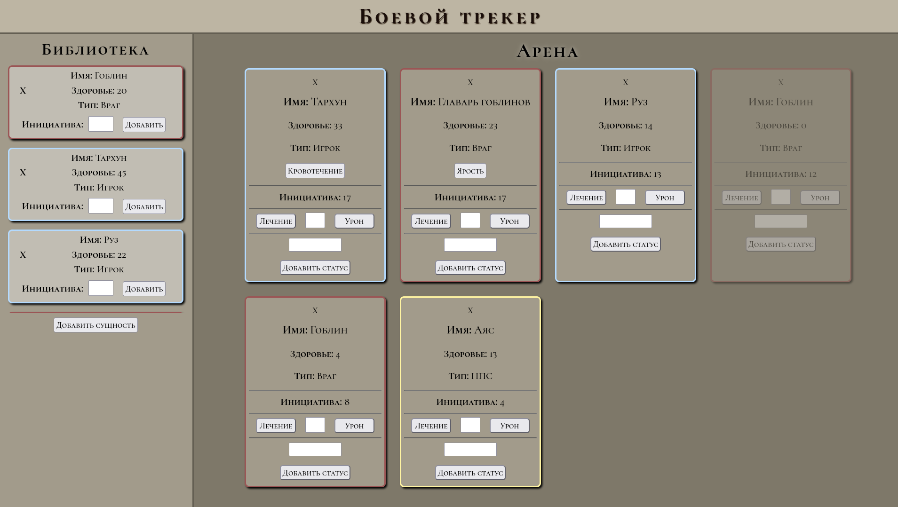

# ⚔️ D&D Battle Tracker

Удобный инструмент для мастеров, созданный для более удобного ведения боя. 

[⭐ Актуальная ссылка:] (https://brdmu.github.io/Dnd-Combat-Tracker/) 

---

## 🛠 Возможности

* Библиотека сущностей: Создавайте шаблоны монстров, игроков и прочих НПС, а после призывайте их в бой в любое время!
* Хранение данных в вашем браузере: Благодаря использованию LocalStorage, ваши данные не пропадут, даже если вы случайно закроете вкладку или браузер.
* Менеджмент боя: Быстрое изменение здоровья (урон/лечение), отслеживание состояний.

## 🎨 Технологии

* Logic: JavaScript (ES6+), ООП (классы для сущностей), работа с DOM.
* Style: CSS Grid & Flexbox, кастомные шрифты (Cormorant Unicase), медиа-запросы.
* Persistence: JSON-сериализация для хранения состояния.

---
*Разработано как часть обучения Javascript, и удобный инструмент для заинтресованных мастеров днд.*
